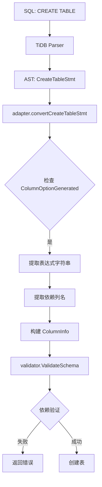
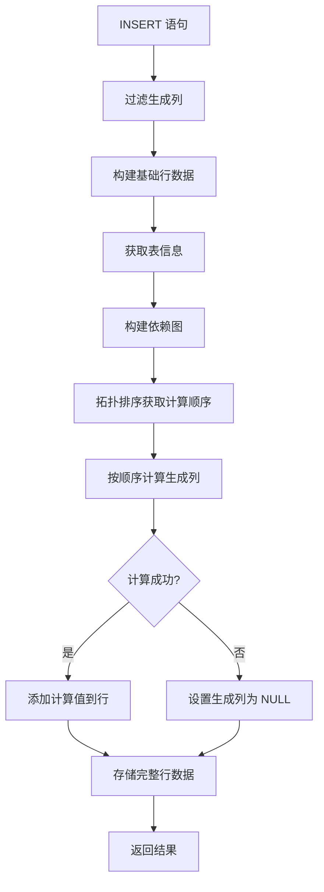
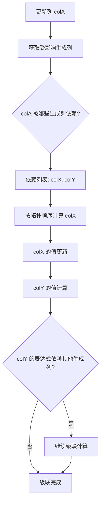

## 产品概述

实现 MySQL 的 Generated Columns（虚拟列）功能，分两个阶段：

- **第一阶段MVP**：实现基础架构，支持 STORED 类型生成列，支持简单表达式（算术、比较、逻辑、字符串、基本函数），实现依赖检查和递归级联更新
- **第二阶段**：完全支持所有表达式，包括用户自定义函数，与 MySQL/TiDB 能力对齐

## 核心功能

### 第一阶段 MVP

1. **DDL 支持**：解析 CREATE TABLE 中的 GENERATED AS (expr) STORED 语法
2. **表达式求值**：支持算术运算（+, -, *, /, %）、比较运算（=, !=, >, <, >=, <=）、逻辑运算（AND, OR, NOT）、字符串连接（CONCAT）、基本函数（UPPER, LOWER, SUBSTRING, TRIM）
3. **依赖管理**：

- 提取生成列表达式中的依赖列
- 检测循环依赖
- 递归更新所有受影响的生成列（多层级联）

4. **错误处理**：表达式计算失败时将生成列值设为 NULL，允许 INSERT/UPDATE 继续
5. **INSERT/UPDATE 集成**：

- 过滤生成列的显式插入/更新值
- 自动计算 STORED 生成列并持久化
- 递归级联更新依赖的生成列

### 第二阶段完整功能

1. **VIRTUAL 类型支持**：动态计算不存储
2. **完整表达式支持**：集成 TiDB expression 包
3. **用户自定义函数**：UDF 支持
4. **索引支持**：STORED 生成列索引、表达式索引
5. **性能优化**：表达式结果缓存、查询优化器集成

## 技术栈选择

- **语言**：Go 1.21+
- **SQL 解析器**：TiDB Parser（已集成）
- **架构模式**：领域驱动设计（DDD）
- **测试框架**：Go 标准测试 + testify/assert

## 技术架构

### 系统架构

```
┌─────────────────────────────────────────────────────────────────────────┐
│                        应用层 (Application)                     │
│  ┌─────────────┐  ┌─────────────┐  ┌─────────────┐  │
│  │   Parser    │  │   Builder    │  │   Adapter    │  │
│  │  (SQL→AST) │  │ (AST→Plan)  │  │ (AST→Obj)   │  │
│  └─────────────┘  └─────────────┘  └─────────────┘  │
└─────────────────────────────────────────────────────────────────────────┘
                              ↓
┌─────────────────────────────────────────────────────────────────────────┐
│                     领域层 (Domain)                        │
│  ┌───────────────────────────────────────────────────────┐      │
│  │           ColumnInfo + GeneratedColumnFields      │      │
│  └───────────────────────────────────────────────┘      │
│  ┌───────────────────────────────────────────────────────┐      │
│  │       GeneratedColumnValidator              │      │
│  │  - 依赖检查      │      │
│  │  - 循环依赖检测                                │      │
│  └───────────────────────────────────────────────┘      │
└─────────────────────────────────────────────────────────────────┘
                              ↓
┌─────────────────────────────────────────────────────────────────────────┐
│              基础设施层 (Infrastructure)                  │
│  ┌───────────────────────────────────────────────────────┐      │
│  │         GeneratedColumnEvaluator              │      │
│  │  - 表达式解析                                 │      │
│  │  - 表达式求值                                 │      │
│  │  - 递归级联更新                                │      │
│  └───────────────────────────────────────────────┘      │
│  ┌───────────────────────────────────────────────────────┐      │
│  │       MVCCDataSource (Update Methods)       │      │
│  │  - 过滤生成列                                 │      │
│  │  - 计算并存储 STORED 列                          │      │
│  └───────────────────────────────────────────────┘      │
└─────────────────────────────────────────────────────────────────┘
```

### 模块划分

#### 1. Parser 层（pkg/parser/）

- **扩展 ColumnInfo**：添加生成列字段
- **AST 转换**：识别 ColumnOptionGenerated
- **表达式提取**：从 AST 提取列名依赖

#### 2. Domain 层（pkg/resource/domain/）

- **数据模型**：ColumnInfo 添加生成列字段
- **验证器接口**：SchemaValidation 接口

#### 3. Infrastructure 层

- **求值器**（pkg/resource/generated/）：表达式求值引擎
- **工具模块**（pkg/resource/generated/utils.go）：公共方法

#### 4. DataSource 层（pkg/resource/memory/）

- **MVCCDataSource 集成**：Insert/Update 修改

## 实现细节

### 核心目录结构

```
d:/code/db/
├── pkg/
│   ├── parser/
│   │   ├── types.go                          # [MODIFY] 扩展 ColumnInfo
│   │   ├── adapter.go                        # [MODIFY] 解析生成列
│   │   └── expr_extractor.go                 # [NEW] 表达式依赖提取
│   ├── resource/
│   │   ├── domain/
│   │   │   └── models.go                     # [MODIFY] 扩展 ColumnInfo
│   │   ├── generated/                         # [NEW] 生成列模块
│   │   │   ├── evaluator.go                 # 表达式求值器
│   │   │   ├── validator.go                 # 依赖验证器
│   │   │   ├── utils.go                    # 公共工具方法
│   │   │   ├── evaluator_test.go            # 求值器测试
│   │   │   └── validator_test.go            # 验证器测试
│   │   └── memory/
│   │       ├── mvcc_datasource.go          # [MODIFY] 集成生成列
│   │       ├── generated_helper.go         # [NEW] 生成列辅助函数
│   │       └── mvcc_datasource_test.go    # [MODIFY] 添加生成列测试
```

### 关键代码结构

#### ColumnInfo 扩展

```
// pkg/parser/types.go 和 pkg/resource/domain/models.go
type ColumnInfo struct {
    Name         string           `json:"name"`
    Type         string           `json:"type"`
    Nullable     bool             `json:"nullable"`
    Primary      bool             `json:"primary"`
    Default      interface{}      `json:"default,omitempty"`
    AutoInc      bool             `json:"auto_increment,omitempty"`
    Unique       bool             `json:"unique,omitempty"`
    Comment      string           `json:"comment,omitempty"`
    
    // 新增：生成列支持
    IsGenerated      bool     `json:"is_generated,omitempty"`
    GeneratedType    string   `json:"generated_type,omitempty"`    // "STORED" (MVP阶段)
    GeneratedExpr    string   `json:"generated_expr,omitempty"`     // 表达式字符串
    GeneratedDepends []string `json:"generated_depends,omitempty"` // 依赖的列名
}
```

#### 生成列求值器接口

```
// pkg/resource/generated/evaluator.go
type GeneratedColumnEvaluator struct{}

// Evaluate 评估单个生成列表达式
func (e *GeneratedColumnEvaluator) Evaluate(
    expr string,
    row domain.Row,
    schema *domain.TableInfo,
) (interface{}, error)

// EvaluateAll 递归计算所有生成列（级联更新）
func (e *GeneratedColumnEvaluator) EvaluateAll(
    row domain.Row,
    schema *domain.TableInfo,
) (domain.Row, error)

// GetEvaluationOrder 获取生成列计算顺序（拓扑排序）
func (e *GeneratedColumnEvaluator) GetEvaluationOrder(
    schema *domain.TableInfo,
) ([]string, error)
```

#### 表达式支持（第一阶段 MVP）

```
// pkg/resource/generated/evaluator.go
// 支持的表达式类型：
// 1. 算术运算：+, -, *, /, %
// 2. 比较运算：=, !=, >, <, >=, <=
// 3. 逻辑运算：AND, OR, NOT
// 4. 字符串操作：CONCAT
// 5. 基本函数：UPPER, LOWER, SUBSTRING, TRIM

// 函数映射
var builtinFunctions = map[string]func(...interface{}) (interface{}, error){
    "UPPER":    upperFunc,
    "LOWER":    lowerFunc,
    "CONCAT":   concatFunc,
    "SUBSTRING": substringFunc,
    "TRIM":     trimFunc,
}
```

#### 依赖验证器

```
// pkg/resource/generated/validator.go
type GeneratedColumnValidator struct{}

// ValidateSchema 验证生成列定义
func (v *GeneratedColumnValidator) ValidateSchema(
    tableInfo *domain.TableInfo,
) error {
    // 1. 检查循环依赖（拓扑排序）
    // 2. 检查依赖的列是否存在
    // 3. 检查生成列是否引用自身
    // 4. 检查是否引用 AUTO_INCREMENT 列
}

// CheckCyclicDependency 循环依赖检测
func (v *GeneratedColumnValidator) CheckCyclicDependency(
    colName string,
    deps map[string][]string,
) error

// BuildDependencyGraph 构建依赖图
func (v *GeneratedColumnValidator) BuildDependencyGraph(
    schema *domain.TableInfo,
) map[string][]string
```

#### INSERT 操作集成

```
// pkg/resource/memory/mvcc_datasource.go (Insert 方法修改)
func (m *MVCCDataSource) Insert(...) (int64, error) {
    // 1. 获取表信息
    tableData := ...
    
    // 2. 过滤生成列（不允许显式插入）
    filteredRows := make([]domain.Row, len(rows))
    evaluator := &generated.GeneratedColumnEvaluator{}
    
    for i, row := range rows {
        filteredRow := make(domain.Row)
        for k, v := range row {
            if !generated.IsGeneratedColumn(k, tableData.schema) {
                filteredRow[k] = v
            }
        }
        
        // 3. 递归计算所有生成列（级联更新）
        computedRow, err := evaluator.EvaluateAll(filteredRow, tableData.schema)
        if err != nil {
            // 错误处理：将生成列设为 NULL
            computedRow = generated.SetGeneratedColumnsToNULL(filteredRow, tableData.schema)
        }
        filteredRows[i] = computedRow
    }
    
    // 4. 存储包含生成列值的数据
    // ...
}
```

#### UPDATE 操作集成

```
// pkg/resource/memory/mvcc_datasource.go (Update 方法修改)
func (m *MVCCDataSource) Update(...) (int64, error) {
    // 1. 过滤生成列的更新值（不允许显式更新）
    filteredUpdates := make(domain.Row)
    for k, v := range updates {
        if !generated.IsGeneratedColumn(k, tableData.schema) {
            filteredUpdates[k] = v
        }
    }
    
    // 2. 获取受影响的生成列（递归）
    affectedGeneratedCols := generated.GetAffectedGeneratedColumns(
        getUpdatedColumns(filteredUpdates),
        tableData.schema,
    )
    
    // 3. 对每行应用更新并重新计算所有受影响的生成列
    for _, row := range sourceData.rows {
        if util.MatchesFilters(row, filters) {
            // 更新非生成列
            newRow := copyRow(row)
            for k, v := range filteredUpdates {
                newRow[k] = v
            }
            
            // 递归计算所有受影响的生成列
            evaluator := &generated.GeneratedColumnEvaluator{}
            for _, genColName := range affectedGeneratedCols {
                colInfo := getColumnInfo(genColName, tableData.schema)
                val, err := evaluator.Evaluate(colInfo.GeneratedExpr, newRow, tableData.schema)
                if err != nil {
                    val = nil // 计算失败设为 NULL
                }
                newRow[genColName] = val
            }
            
            newRow = computedRow
        }
    }
    
    // ...
}
```

## 性能优化

### 1. 依赖图缓存

- 表创建时构建依赖图并缓存
- 避免每次插入/更新时重新计算

### 2. 计算顺序优化

- 使用拓扑排序预先生成列计算顺序
- INSERT/UPDATE 时按顺序直接计算

### 3. 表达式解析缓存

- 解析后的表达式 AST 节点缓存
- 避免重复解析同一表达式

### 复杂度分析

- **计算时间复杂度**：
- 依赖图构建：O(n)，n 为列数
- 拓扑排序：O(n + e)，e 为依赖边数
- 单列计算：O(1)，表达式复杂度决定
- 所有生成列计算：O(g)，g 为生成列数
- **空间复杂度**：O(n) 存储依赖图

## 数据流

### CREATE TABLE 流程



### INSERT 流程



### 级联更新流程



## 实现细节

### 执行注意事项

1. **类型转换**：表达式结果类型与列定义类型可能不一致，需实现 CastToType 函数
2. **NULL 传播**：基础列的 NULL 值应正确传播到生成列
3. **除零处理**：捕获 panic 并返回 nil，设为 NULL
4. **并发安全**：MVCC 的 COW 机制已处理并发，求值器需无状态
5. **错误日志**：生成列计算失败时记录警告，不阻断操作

### 错误处理

- **表达式解析失败**：记录错误，返回 nil 值
- **表达式求值失败**：记录警告，返回 nil 值
- **类型转换失败**：记录警告，返回 nil 值
- **循环依赖**：返回明确错误信息，拒绝 CREATE TABLE

### 向后兼容性

- 不影响现有非生成列的表
- 添加字段保持向后兼容（使用omitempty）
- 现有测试应全部通过

本任务不涉及 UI 创建或改造，无需设计方案。