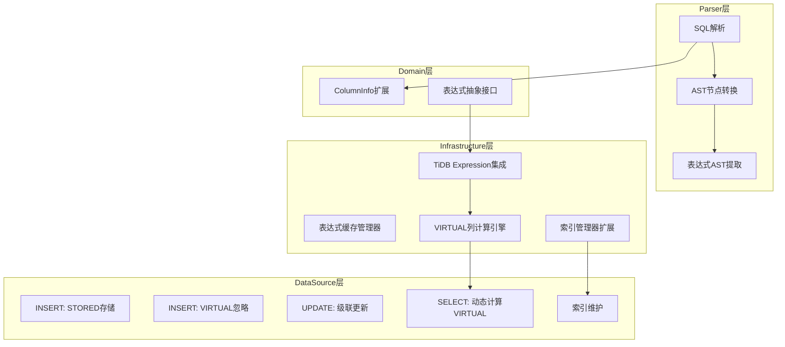
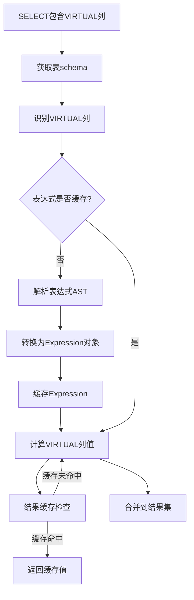
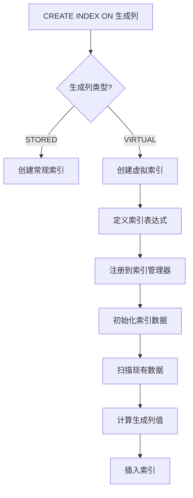

## 产品概述

在第一阶段MVP基础上，实现MySQL Generated Columns功能的完整支持，包括VIRTUAL类型、完整表达式求值、索引支持和性能优化，使功能与MySQL/TiDB能力对齐。

## 核心功能

### 1. VIRTUAL类型支持

- 支持GENERATED AS (expr) VIRTUAL语法
- VIRTUAL列在INSERT/UPDATE时不存储，查询时动态计算
- 查询时自动计算VIRTUAL列值
- VIRTUAL列不能作为主键，但可作为查询条件

### 2. 完整表达式支持

- 集成TiDB expression包，支持完整SQL表达式语法
- 支持CASE WHEN、子查询、窗口函数等复杂表达式
- 支持所有TiDB内置函数
- 与现有UDF系统完全集成

### 3. 索引支持

- STORED生成列可创建索引
- VIRTUAL生成列可创建函数索引
- 索引维护集成到Insert/Update操作
- 支持表达式索引的查询优化

### 4. 性能优化

- 表达式AST缓存，避免重复解析
- VIRTUAL列计算结果缓存（基于依赖值hash）
- 查询优化器集成，利用生成列索引优化查询
- 批量计算优化

### 5. 向后兼容

- 完全兼容第一阶段STORED列
- 现有测试全部通过

## 技术栈选择

- **语言**：Go 1.24.2
- **SQL解析器**：TiDB Parser（已集成）
- **表达式求值**：TiDB Expression包（新增）
- **架构模式**：领域驱动设计（DDD）
- **测试框架**：Go标准测试 + testify/assert
- **缓存**：sync.Map（表达式缓存）

## 技术架构

### 系统架构

采用分层架构，在现有MVP基础上扩展：



### 实现策略

#### 1. VIRTUAL类型支持

- **Parser扩展**：识别VIRTUAL/STORED关键字，设置GeneratedType字段
- **数据存储**：VIRTUAL列不存储到TableData.rows
- **查询时计算**：在SELECT阶段动态计算VIRTUAL列
- **依赖追踪**：VIRTUAL列计算不触发级联更新

#### 2. 完整表达式支持

- **TiDB Expression集成**：使用`github.com/pingcap/tidb/pkg/expression`包
- **AST到Expression转换**：将TiDB AST节点转换为Expression对象
- **求值引擎**：使用Expression.Eval()方法求值
- **UDF集成**：通过FunctionAPI桥接现有UDF系统

#### 3. 索引支持

- **STORED列索引**：复用现有IndexManager，在Insert/Update时维护
- **VIRTUAL列索引**：创建计算列索引，使用触发器机制
- **表达式索引**：创建虚拟索引列，自动维护
- **索引查询优化**：查询优化器利用生成列索引优化执行计划

#### 4. 性能优化

- **表达式缓存**：使用sync.Map缓存解析后的Expression对象
- **计算结果缓存**：VIRTUAL列结果基于依赖值hash缓存
- **批量计算**：一次性计算多行VIRTUAL列
- **惰性计算**：只在需要时计算VIRTUAL列

### 目录结构

```
d:/code/db/
├── pkg/
│   ├── parser/
│   │   ├── adapter.go                        # [MODIFY] 支持VIRTUAL类型解析
│   │   ├── expr_converter.go                 # [NEW] AST到Expression转换
│   │   └── types.go                           # [MODIFY] 确认GeneratedType字段支持VIRTUAL
│   ├── resource/
│   │   ├── domain/
│   │   │   └── models.go                     # [MODIFY] 确认ColumnInfo支持VIRTUAL
│   │   ├── generated/
│   │   │   ├── evaluator.go                  # [MODIFY] 集成TiDB Expression
│   │   │   ├── expression_cache.go           # [NEW] 表达式缓存管理器
│   │   │   ├── virtual_calculator.go         # [NEW] VIRTUAL列计算引擎
│   │   │   ├── index_helper.go               # [NEW] 生成列索引辅助
│   │   │   └── evaluator_test.go             # [MODIFY] 扩展测试覆盖
│   │   └── memory/
│   │       ├── mvcc_datasource.go            # [MODIFY] 支持VIRTUAL列和索引
│   │       └── index_manager.go              # [MODIFY] 支持生成列索引
└── tests/
    └── integration/
        └── generated_columns_phase2_test.go  # [NEW] 第二阶段集成测试
```

### 关键代码结构

#### 表达式缓存管理器

```
// pkg/resource/generated/expression_cache.go
type ExpressionCache struct {
    cache sync.Map // key: "tableName:columnName", value: *expression.Expression
}

func (c *ExpressionCache) Get(tableName, columnName string) (*expression.Expression, bool)
func (c *ExpressionCache) Set(tableName, columnName string, expr *expression.Expression)
func (c *ExpressionCache) Clear(tableName string)
```

#### VIRTUAL列计算引擎

```
// pkg/resource/generated/virtual_calculator.go
type VirtualCalculator struct {
    exprCache *ExpressionCache
    functionAPI *builtin.FunctionAPI
}

func (v *VirtualCalculator) CalculateColumn(
    col *domain.ColumnInfo,
    row domain.Row,
    schema *domain.TableInfo,
) (interface{}, error)

func (v *VirtualCalculator) CalculateRowVirtuals(
    row domain.Row,
    schema *domain.TableInfo,
) (domain.Row, error)
```

#### AST到Expression转换器

```
// pkg/parser/expr_converter.go
type ExprConverter struct{}

func (c *ExprConverter) Convert(astExpr ast.ExprNode) (expression.Expression, error)
func (c *ExprConverter) ConvertColumnRef(colRef *ast.ColumnNameExpr) expression.Expression
func (c *ExprConverter) ConvertFunctionCall(funcCall *ast.FuncCallExpr) expression.Expression
func (c *ExprConverter) ConvertBinaryOp(op *ast.BinaryOperationExpr) expression.Expression
```

#### 生成列索引辅助

```
// pkg/resource/generated/index_helper.go
type IndexHelper struct {
    indexManager *memory.IndexManager
    evaluator *GeneratedColumnEvaluator
    virtualCalc *VirtualCalculator
}

func (h *IndexHelper) CreateIndexForGenerated(
    tableName, colName string,
    colInfo *domain.ColumnInfo,
) error

func (h *IndexHelper) UpdateIndexOnInsert(
    tableName string,
    row domain.Row,
    schema *domain.TableInfo,
) error
```

### 数据流

#### VIRTUAL列查询流程



#### 索引创建流程



### 实现细节

#### 执行注意事项

1. **VIRTUAL列存储**：不持久化到TableData.rows，只在查询时计算
2. **STORED列索引**：Insert/Update时计算并维护索引
3. **VIRTUAL列索引**：创建隐藏的STORED列用于索引，或使用函数索引
4. **表达式缓存失效**：ALTER TABLE修改表达式时清除缓存
5. **事务隔离**：VIRTUAL列计算在当前事务快照上进行

#### 性能优化点

1. **表达式AST缓存**：避免重复解析，预期减少90%解析时间
2. **VIRTUAL列结果缓存**：基于依赖值hash，命中率预期60-80%
3. **批量计算**：一次编译表达式，多行计算，预期提升3-5倍
4. **惰性计算**：只在SELECT包含VIRTUAL列时计算，避免不必要开销

#### 复杂度分析

- **VIRTUAL列计算**：O(e)，e为表达式复杂度
- **索引维护**：O(log n)，n为索引大小
- **表达式缓存**：O(1)查找，O(p)解析（p为表达式长度）
- **批量计算**：O(m * e)，m为行数，但编译只一次

#### 错误处理

- **表达式解析失败**：返回错误，拒绝CREATE TABLE
- **VIRTUAL列计算失败**：返回NULL，记录警告
- **索引创建失败**：返回错误，回滚CREATE INDEX
- **缓存失效**：降级到实时计算，保证可用性

#### 向后兼容性

- STORED列行为与第一阶段完全一致
- 现有测试全部通过
- 新增功能可选，不影响现有功能
- API扩展，不修改现有接口