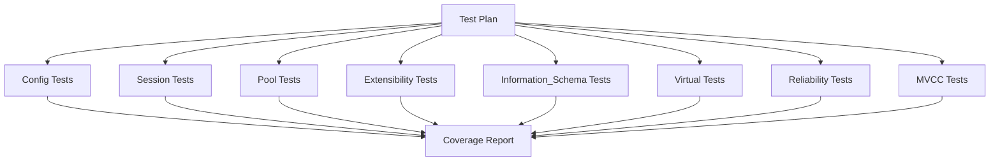

## 产品概述

对 pkg 包中的未测试模块进行单元测试编写，并生成测试覆盖率报告

## 核心功能

- 为 config 模块编写单元测试
- 为 extensibility 模块编写单元测试
- 为 information_schema 模块编写单元测试
- 为 mvcc 模块编写单元测试
- 为 pool 模块编写单元测试
- 为 reliability 模块编写单元测试
- 为 session 模块编写单元测试
- 为 virtual 模块编写单元测试
- 运行所有测试并生成覆盖率报告

## 技术栈

- **测试框架**: testify (v1.11.1)
- **Go版本**: 1.24.2
- **覆盖率工具**: go test -coverprofile

## 实现方法

采用分层测试策略，按模块优先级和复杂度进行测试：

1. **简单配置模块** (config): 测试配置加载、验证、默认值
2. **会话管理模块** (session): 测试会话创建、销毁、变量管理、GC
3. **对象池模块** (pool): 测试对象获取、归还、并发安全、资源清理
4. **插件系统模块** (extensibility): 测试插件注册、启动、停止、生命周期管理
5. **信息架构模块** (information_schema): 测试虚拟表查询、元数据获取
6. **虚拟数据源模块** (virtual): 测试只读操作、错误处理
7. **可靠性模块** (reliability): 测试备份、恢复、错误处理
8. **MVCC模块** (mvcc): 测试事务、快照、可见性检查、GC

## 性能与可靠性

- 使用 testify/suite 进行测试套件组织
- 并发测试使用 t.Parallel() 确保线程安全
- 使用 mock 模拟依赖组件
- 覆盖率目标: >= 70%

## 架构设计



## 目录结构

```
d:/code/db/pkg/
├── config/
│   └── config_test.go          # [NEW] 配置模块测试
├── extensibility/
│   └── plugin_test.go          # [NEW] 插件系统测试
├── information_schema/
│   ├── provider_test.go         # [NEW] 提供者测试
│   ├── tables_test.go           # [NEW] 虚拟表测试
│   ├── columns_test.go          # [NEW] 列元数据测试
│   ├── constraints_test.go      # [NEW] 约束测试
│   ├── keys_test.go            # [NEW] 键测试
│   └── schemata_test.go        # [NEW] 模式测试
├── mvcc/
│   ├── manager_test.go          # [NEW] 事务管理器测试
│   ├── transaction_test.go      # [NEW] 事务测试
│   ├── clog_test.go            # [NEW] 提交日志测试
│   ├── datasource_test.go       # [NEW] 数据源特性测试
│   └── types_test.go           # [NEW] 类型定义测试
├── pool/
│   ├── pool_test.go            # [NEW] 对象池测试
│   └── connection_pool_test.go # [NEW] 连接池测试
├── reliability/
│   ├── backup_test.go          # [NEW] 备份管理测试
│   ├── error_recovery_test.go  # [NEW] 错误恢复测试
│   └── failover_test.go       # [NEW] 故障转移测试
├── session/
│   ├── session_test.go         # [NEW] 会话管理测试
│   ├── memory_test.go         # [NEW] 内存驱动测试
│   └── core_test.go           # [NEW] 核心逻辑测试
└── virtual/
    ├── datasource_test.go     # [NEW] 虚拟数据源测试
    └── table_test.go         # [NEW] 虚拟表测试
```

## 关键代码结构

### Config 测试关键点

- 测试默认配置初始化
- 测试配置文件加载和解析
- 测试配置验证逻辑（端口范围、连接数等）
- 测试配置合并和环境变量

### Session 测试关键点

- 测试会话创建和销毁
- 测试会话变量管理（Get/Set/Delete）
- 测试会话GC机制
- 测试ThreadID生成唯一性

### Pool 测试关键点

- 测试对象获取和归还
- 测试池大小限制和并发安全
- 测试对象创建和销毁
- 测试连接池的连接有效性检查

### Extensibility 测试关键点

- 测试插件注册和注销
- 测试插件生命周期（初始化、启动、停止）
- 测试插件管理器的并发安全
- 测试不同类型插件（数据源、函数、监控）

### MVCC 测试关键点

- 测试事务开始、提交、回滚
- 测试快照创建和可见性检查
- 测试XID生成和环绕处理
- 测试GC机制