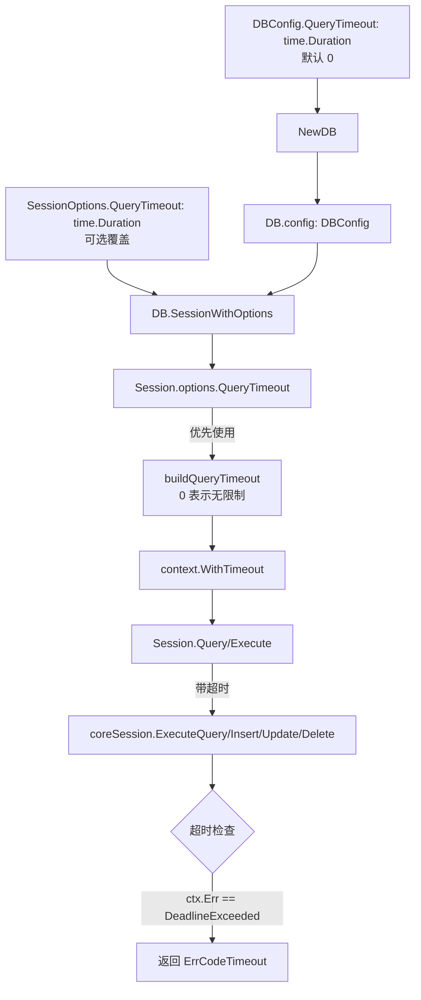

## 产品概述

为数据库查询（Query）和数据操作（Execute）添加超时控制机制，避免长时间运行的查询占用过多资源或陷入死循环。

## 核心功能

- 在 DBConfig 中添加 QueryTimeout 配置项，默认值为 0（不限制）
- 在 SessionOptions 中添加 QueryTimeout 配置项，允许会话级别覆盖全局配置
- Session.Query() 方法使用 context.WithTimeout() 替代 context.Background()，支持超时控制
- Session.Execute() 方法使用带超时的 context，在所有执行路径上应用超时
- 超时后返回 ErrCodeTimeout 错误码，包含 context.DeadlineExceeded 信息
- 向后兼容：默认值 0 表示不限制，保持现有行为
- 配置优先级：Session 级别配置覆盖 DB 级别配置

## 技术栈选择

- 语言：Go 1.24.2
- 标准库：context（用于超时控制）

## 实现方法

使用 Go 标准库的 context.WithTimeout() 机制为所有查询和执行操作添加超时控制。通过在 DBConfig 和 SessionOptions 中添加 QueryTimeout 配置项，支持全局和会话级别的超时设置。超时检测后返回明确的超时错误，便于调用方处理。

## 性能与可靠性

- **性能**：超时控制通过 context 实现零额外开销，不涉及额外 goroutine 或 channel
- **可靠性**：超时后立即返回，避免资源无限占用；错误信息包含上下文，便于调试
- **数据一致性**：超时不会影响已提交的事务，仅中止未完成的操作

## 避免技术债务

- 复用现有的 context 使用模式
- 复用现有的错误处理机制（NewError, WrapError）
- 遵循现有配置层级（DBConfig -> SessionOptions）

## 实现细节

- **默认值处理**：QueryTimeout 默认为 0，context.WithTimeout(timeout) 在 timeout <= 0 时等同于无超时
- **超时检测**：使用 ctx.Err() == context.DeadlineExceeded 判断是否超时
- **配置传递链**：NewDB(config) -> SessionWithOptions(options) -> Query/Execute
- **错误返回**：超时时返回 NewError(ErrCodeTimeout, "query execution timed out", ctx.Err())，保留原始错误信息

## 架构设计



## 目录结构

```

d:/code/db/pkg/api/
├── db.go                    # [MODIFY] 添加 DBConfig.QueryTimeout 字段
├── session_types.go           # [MODIFY] 添加 SessionOptions.QueryTimeout 字段
├── session.go                 # [MODIFY] 添加 buildQueryTimeout 方法
├── session_query.go          # [MODIFY] Query 方法使用超时 context
└── session_dml.go            # [MODIFY] Execute 方法使用超时 context

```

## 关键代码结构

```

// DBConfig 添加查询超时配置
type DBConfig struct {
CacheEnabled  bool
CacheSize     int
CacheTTL      int
DefaultLogger Logger
DebugMode     bool
QueryTimeout  time.Duration  // 新增：查询超时时间，0 表示不限制
}

// SessionOptions 添加查询超时配置
type SessionOptions struct {
DataSourceName string
Isolation      IsolationLevel
ReadOnly       bool
CacheEnabled   bool
QueryTimeout   time.Duration  // 新增：查询超时时间，覆盖 DBConfig
}

// Session 添加超时构建方法
func (s *Session) buildQueryTimeout() time.Duration {
if s.options != nil && s.options.QueryTimeout > 0 {
return s.options.QueryTimeout
}
if s.db != nil && s.db.config != nil && s.db.config.QueryTimeout > 0 {
return s.db.config.QueryTimeout
}
return 0
}
```