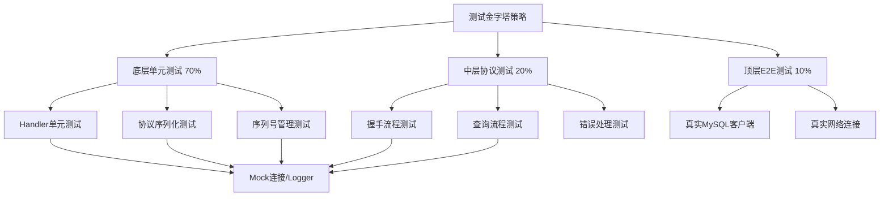

## 产品概述

优化server层的测试架构，通过增加单元测试覆盖率来降低对集成测试和端到端测试的依赖，减少人工测试介入的频率。

## 核心功能

- 构建Handler层的可测试单元测试框架（使用Mock替代真实网络连接）
- 实现协议交互流程的端到端测试（模拟真实客户端-服务器交互）
- 添加序列号管理的独立测试
- 增加网络边界条件测试
- 提升测试覆盖率，减少需要人工验证的协议问题

## 技术栈

### 测试框架

- **测试框架**: Go标准testing包 + testify/assert
- **Mock工具**: 自定义Mock实现（MockConnection, MockLogger, MockDBAccessor）
- **测试辅助工具**: testing/quick（可选，用于属性测试）

### 测试层级

#### 1. Handler层单元测试

- 目标：独立测试每个Handler的逻辑，不依赖真实网络连接
- 策略：使用Mock的HandlerContext（MockConnection, MockLogger）

#### 2. 协议交互测试

- 目标：测试完整的协议交互流程（握手->认证->命令->响应）
- 策略：使用Mock连接模拟真实客户端行为

#### 3. 序列号管理测试

- 目标：独立测试序列号递增、重置逻辑
- 策略：单元测试Session的SequenceID管理

## 实现方案

### 测试架构改进策略

采用**测试金字塔**策略，增加底层单元测试比例：

- **底层（70%）**: Handler单元测试 + 协议序列化测试
- **中层（20%）: 协议交互流程测试（使用Mock连接）
- **顶层（10%）: 真实E2E测试（保留现有测试作为最终验证）

### 关键测试组件

#### 1. Mock连接实现

- **MockConnection**: 实现`net.Conn`接口，记录写入的数据包，支持读取模拟响应
- **MockLogger**: 记录所有日志调用，便于断言验证
- **MockDBAccessor**: 模拟API层DB，避免真实数据库依赖

#### 2. Handler单元测试

为每个Handler创建独立测试：

- **PingHandler测试**: 验证OK响应和序列号重置
- **QueryHandler测试**: 验证查询执行、结果集构建、序列号递增
- **InitDBHandler测试**: 验证数据库切换逻辑
- **FieldListHandler测试**: 验证字段列表响应
- **ProcessKillHandler测试**: 验证查询终止逻辑

#### 3. 协议流程测试

测试完整协议交互序列：

- **握手流程**: HandshakeV10Packet -> HandshakeResponse -> OkPacket
- **查询流程**: ComQueryPacket -> 结果集（ColumnCount + Fields + EOF + Rows + EOF）
- **错误流程**: 错误查询 -> ErrorPacket（错误码、SQLState、错误消息）
- **序列号管理**: 验证每轮交互的序列号递增和重置

#### 4. 边界条件测试

- **大包测试**: 测试16MB+包的拆分处理
- **空包测试**: 验证空查询/命令的处理
- **特殊字符测试**: 测试Unicode、NULL字符、特殊SQL语法
- **并发连接测试**: 多个客户端同时连接和查询

## 实现细节

### Mock连接设计

```
type MockConnection struct {
    mu         sync.Mutex
    writtenData [][]byte
    readQueue  [][]byte
    closed     bool
}
```

**功能**：

- 记录所有Write调用，用于断言验证发送的包
- 支持模拟读取预定义的响应
- 模拟网络错误（可配置）

### Handler单元测试模式

```
func TestPingHandler_Handle(t *testing.T) {
    // Given: 创建Mock上下文
    mockConn := NewMockConnection()
    mockLogger := NewMockLogger()
    ctx := handler.NewHandlerContext(mockSession, mockConn, protocol.COM_PING, mockLogger)
    
    // When: 处理PING命令
    handler := simple.NewPingHandler()
    err := handler.Handle(ctx, &protocol.ComPingPacket{})
    
    // Then: 验证OK包发送和序列号
    assert.NoError(t, err)
    assert.Equal(t, 1, len(mockConn.writtenData))
    assert.Equal(t, protocol.COM_PING, handler.Command())
}
```

### 协议流程测试模式

```
func TestProtocol_HandshakeAndQuery(t *testing.T) {
    // Given: 创建服务器和Mock客户端
    testServer := NewMockTestServer()
    client := NewMockClient(testServer)
    
    // When: 完整握手流程
    err := client.Handshake()
    assert.NoError(t, err)
    
    // And: 执行查询
    result, err := client.Query("SELECT 1")
    
    // Then: 验证完整响应流程
    assert.NoError(t, err)
    assert.Equal(t, "1", result[0][0])
}
```

### 序列号管理测试

```
func TestSequenceID_Management(t *testing.T) {
    // 测试序列号递增
    sess := NewSession()
    assert.Equal(t, uint8(0), sess.GetNextSequenceID())
    assert.Equal(t, uint8(1), sess.GetNextSequenceID())
    
    // 测试序列号重置
    sess.ResetSequenceID()
    assert.Equal(t, uint8(0), sess.GetNextSequenceID())
    
    // 测试溢出处理
    for i := 0; i < 300; i++ {
        sess.GetNextSequenceID()
    }
    // 验证正确回绕
}
```

## 架构设计

### 测试文件组织

```
server/
├── handler/
│   ├── simple/
│   │   ├── ping_handler.go
│   │   └── ping_handler_test.go  [NEW]
│   ├── query/
│   │   ├── query_handler.go
│   │   └── query_handler_test.go  [NEW]
│   └── process/
│       ├── init_db_handler.go
│       └── init_db_handler_test.go  [NEW]
├── protocol/
│   ├── packet.go
│   └── packet_test.go
├── testing/  [NEW]
│   ├── mock_connection.go    [NEW] Mock连接实现
│   ├── mock_logger.go       [NEW] Mock日志实现
│   ├── protocol_flow_test.go  [NEW] 协议流程测试
│   └── sequence_test.go       [NEW] 序列号测试
└── tests/
    └── end_to_end_test.go  保留真实E2E测试
```

### 测试执行流程



## 目录结构

### 新增测试文件

```
server/
├── handler/
│   ├── simple/
│   │   └── ping_handler_test.go  # [NEW] PingHandler单元测试
│   ├── query/
│   │   └── query_handler_test.go  # [NEW] QueryHandler单元测试
│   └── process/
│       └── init_db_handler_test.go  # [NEW] InitDBHandler单元测试
├── testing/  # [NEW] 测试辅助工具
│   ├── mock_connection.go  # Mock连接实现
│   ├── mock_logger.go  # Mock日志实现
│   ├── mock_session.go  # Mock Session实现
│   ├── protocol_flow_test.go  # 协议流程测试
│   └── sequence_test.go  # 序列号管理测试
└── protocol/
    └── sequence_test.go  # [NEW] 包序列化测试补充
```

### 文件说明

#### server/handler/simple/ping_handler_test.go [NEW]

- **目的**: PingHandler单元测试
- **功能**: 测试Ping处理逻辑、OK响应、序列号重置
- **实现**:
- 验证Handler返回正确的命令类型
- 验证OK包正确发送到Mock连接
- 验证序列号被正确重置

#### server/handler/query/query_handler_test.go [NEW]

- **目的**: QueryHandler单元测试
- **功能**: 测试查询处理、结果集构建、错误处理
- **实现**:
- 测试简单SELECT查询
- 测试错误查询的Error包
- 测试空结果集的OK响应
- 测试多行结果集
- 验证所有包的序列号递增

#### server/handler/process/init_db_handler_test.go [NEW]

- **目的**: InitDBHandler单元测试
- **功能**: 测试USE命令处理
- **实现**:
- 验证数据库切换
- 验证Session的currentDB更新
- 测试无效数据库名称处理

#### server/testing/mock_connection.go [NEW]

- **目的**: Mock网络连接实现
- **功能**: 实现net.Conn接口，记录写入数据，支持模拟读取
- **实现**:
- Write方法：记录所有写入的字节
- Read方法：从预定义队列读取（可选）
- Close方法：标记连接关闭
- 获取写入数据的方法：用于测试断言

#### server/testing/mock_logger.go [NEW]

- **目的**: Mock日志实现
- **功能**: 记录所有日志调用，支持断言验证
- **实现**:
- Printf方法：记录格式化消息
- 获取日志记录的方法
- 支持验证日志级别和内容

#### server/testing/mock_session.go [NEW]

- **目的**: Mock Session实现
- **功能**: 模拟pkg/session.Session，避免真实Session依赖
- **实现**:
- 实现Session接口的所有方法
- 模拟ThreadID管理
- 模拟SequenceID管理（重点测试）
- 支持APISession注入

#### server/testing/protocol_flow_test.go [NEW]

- **目的**: 完整协议交互流程测试
- **功能**: 测试握手、查询、错误等完整流程
- **实现**:
- 握手流程测试（Handshake -> HandshakeResponse -> OK）
- 查询流程测试（Query -> ColumnCount -> Fields -> EOF -> Rows -> EOF）
- 错误流程测试（Error Query -> Error Packet）
- 多命令序列测试（验证序列号管理）

#### server/testing/sequence_test.go [NEW]

- **目的**: 序列号管理独立测试
- **功能**: 测试SequenceID递增、重置、溢出处理
- **实现**:
- 测试初始值为0
- 测试每次GetNextSequenceID递增
- 测试ResetSequenceID重置为0
- 测试255溢出后回绕到0
- 测试并发安全性（如果需要）

#### server/protocol/sequence_test.go [NEW]

- **目的**: 包序列号字段的测试补充
- **功能**: 测试Packet.SequenceID的Marshal/Unmarshal
- **实现**:
- 测试序列号字段正确序列化
- 测试序列号字段正确反序列化
- 测试不同序列号值（0, 1, 127, 128, 254, 255）

本计划不涉及UI设计，仅涉及测试架构和代码结构。