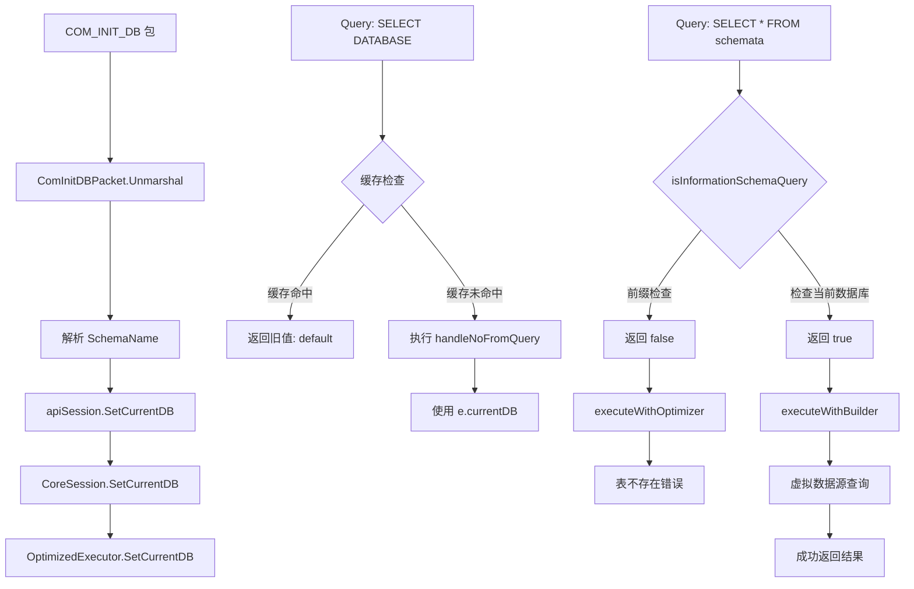

## 产品概述

修复 MySQL 协议处理中 `USE information_schema` 后两个核心问题：

1. `SELECT DATABASE()` 返回 `default` 而非 `information_schema`
2. `SELECT * FROM schemata` 报错 `table schemata not found`

## 核心功能

- COM_INIT_DB 数据包正确解析数据库名（无 null 终止符）
- SET DATABASE() 正确返回当前数据库名
- information_schema 虚拟表查询正确路由
- 查询缓存感知数据库切换，避免返回过期数据

## 技术栈

- Go 语言
- MySQL 协议实现
- 查询缓存机制
- 虚拟数据源

## 技术架构

### 问题根源分析

**问题 1：SELECT DATABASE() 返回错误值**

- **原因**：查询缓存机制不感知数据库切换。`SELECT DATABASE()` 的结果被缓存后，即使调用了 `SetCurrentDB`，缓存中仍保存旧值
- **位置**：`pkg/api/session_query.go:40-58`，缓存键生成只包含 SQL，未包含当前数据库上下文

**问题 2：select * from schemata 找不到表**

- **原因**：`isInformationSchemaQuery()` 只检查 `information_schema.` 前缀，未考虑当前数据库是 `information_schema` 的情况
- **位置**：`pkg/optimizer/optimized_executor.go:200-207`

### 系统架构图



## 实现方案

### 核心策略

1. **修复缓存键生成**：在缓存键中包含当前数据库上下文
2. **扩展 information_schema 识别**：检查当前数据库是否为 `information_schema`
3. **清除相关缓存**：切换数据库时清除包含 `DATABASE()` 的查询缓存

### 关键代码结构

#### 修改 1：pkg/api/cache.go - 缓存键生成

在缓存键中加入数据库上下文，确保不同数据库的查询不会互相干扰

#### 修改 2：pkg/api/session_lifecycle.go - 清除缓存

切换数据库时清除 `SELECT DATABASE()` 的缓存

#### 修改 3：pkg/optimizer/optimized_executor.go - information_schema 识别

扩展 `isInformationSchemaQuery()` 方法，支持当前数据库为 `information_schema` 的情况

## 实现细节

### 性能考虑

- 缓存键生成增加数据库上下文后，仍保持 O(1) 查找性能
- 清除缓存只针对特定查询，不影响整体缓存性能

### 日志增强

- 在关键路径添加调试日志，追踪数据库切换和缓存状态

## 目录结构

```
project-root/
├── pkg/
│   ├── api/
│   │   ├── cache.go              # [MODIFY] 修改 generateKey 方法，添加数据库上下文
│   │   └── session_lifecycle.go   # [MODIFY] SetCurrentDB 清除 DATABASE() 缓存
│   └── optimizer/
│       └── optimized_executor.go   # [MODIFY] isInformationSchemaQuery 支持当前数据库
```

## 关键代码结构

### 缓存键修改

```
// 在 QueryCache 结构中添加 currentDB 上下文
type QueryCache struct {
    store      map[string]*CacheEntry
    storeSize  int
    currentDB  string  // 新增：当前数据库上下文
}

// 修改 generateKey 方法
func (c *QueryCache) generateKey(sql string, params []interface{}) string {
    // 在键中包含 currentDB
    h := fnv.New32a()
    h.Write([]byte(sql))
    h.Write([]byte(c.currentDB))  // 新增：数据库上下文
    return fmt.Sprintf("%x", h.Sum32())
}
```

### information_schema 识别修改

```
// 扩展 isInformationSchemaQuery 方法
func (e *OptimizedExecutor) isInformationSchemaQuery(tableName string) bool {
    if e.dsManager == nil {
        return false
    }
    
    // 检查前缀
    if strings.HasPrefix(strings.ToLower(tableName), "information_schema.") {
        return true
    }
    
    // 检查当前数据库是否为 information_schema
    if strings.EqualFold(e.currentDB, "information_schema") {
        return true
    }
    
    return false
}
```

##