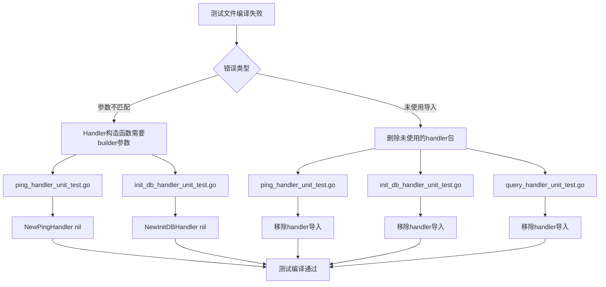

## 产品概述

修复 server/handler 目录下无法编译的测试文件，使其能够正常运行。

## 核心功能

- 修复构造函数调用参数不匹配的问题
- 移除未使用的包导入
- 确保所有测试文件能够编译通过

## 技术栈

- 语言: Go (Golang)
- 测试框架: Go testing + testify/assert
- 项目路径: d:/code/db

## 实现方法

通过修改现有测试文件，修复编译错误：

1. **构造函数参数修复**：部分 Handler 的构造函数需要传入 builder 参数（可为 nil）
2. **移除未使用导入**：删除测试文件中未使用的 `handler` 包导入

## 架构设计

### 当前测试文件问题分析



### Handler 构造函数签名

需要 builder 参数的 Handler：

- `NewPingHandler(okBuilder *response.OKBuilder)`
- `NewInitDBHandler(okBuilder *response.OKBuilder)`

不需要参数的 Handler：

- `NewQueryHandler()`

## 实现细节

### 目录结构

```
d:/code/db/server/handler/
├── simple/
│   └── ping_handler_unit_test.go     # [MODIFY] 修复构造函数调用和导入
└── query/
    ├── init_db_handler_unit_test.go   # [MODIFY] 修复构造函数调用和导入
    └── query_handler_unit_test.go     # [MODIFY] 修复未使用导入
```

### 修改内容

**1. ping_handler_unit_test.go**

- 移除第 6 行: `"github.com/kasuganosora/sqlexec/server/handler"` 导入
- 修改第 13、19 行: `NewPingHandler()` → `NewPingHandler(nil)`

**2. init_db_handler_unit_test.go**

- 移除第 6 行: `"github.com/kasuganosora/sqlexec/server/handler"` 导入
- 修改第 13、19 行: `NewInitDBHandler(nil)` 保持不变（已正确）

**3. query_handler_unit_test.go**

- 移除第 6 行: `"github.com/kasuganosora/sqlexec/server/handler"` 导入
- `NewQueryHandler()` 调用保持不变（无需参数）

### 验证方法

运行 `go test ./server/handler/...` 确保所有测试编译通过