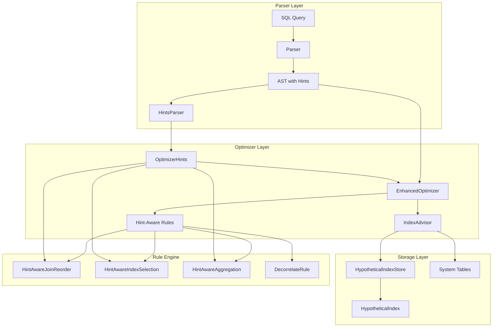

# Index Advisor 和 Optimizer Hints 实现设计

## 概述

实现 TiDB v8.5.0+ 兼容的索引推荐 (Index Advisor) 和 Optimizer Hints 功能。

## 核心功能

### 1. Optimizer Hints

支持以下 Hint 类型：

**JOIN Hints:**
- `HASH_JOIN(t1, t2)` - 使用 Hash Join
- `MERGE_JOIN(t1, t2)` - 使用 Sort Merge Join
- `INL_JOIN(t1, t2)` - 使用 Index Nested Loop Join
- `INL_HASH_JOIN(t1, t2)` - 使用 Index Nested Loop Hash Join
- `INL_MERGE_JOIN(t1, t2)` - 使用 Index Nested Loop Merge Join
- `NO_MERGE_JOIN(t1, t2)` - 不使用 Merge Join
- `NO_INDEX_JOIN(t1, t2)` - 不使用 Index Join

**INDEX Hints:**
- `USE_INDEX(t, idx1, idx2)` - 仅使用指定索引
- `FORCE_INDEX(t, idx1, idx2)` - 强制使用指定索引
- `IGNORE_INDEX(t, idx1, idx2)` - 忽略指定索引
- `ORDER_INDEX(t, idx)` - 按顺序读取索引
- `NO_ORDER_INDEX(t, idx)` - 不按顺序读取索引
- `INDEX_LOOKUP_PUSHDOWN(t, idx)` - 下推 IndexLookUp

**AGG Hints:**
- `HASH_AGG()` - 使用 Hash Aggregation
- `STREAM_AGG()` - 使用 Stream Aggregation
- `MPP_1PHASE_AGG()` - 使用一阶段聚合（MPP 模式）
- `MPP_2PHASE_AGG()` - 使用二阶段聚合（MPP 模式）

**Subquery Hints:**
- `SEMI_JOIN_REWRITE()` - 将 Semi Join 改写为普通 Join
- `NO_DECORRELATE()` - 不解除关联子查询
- `USE_TOJA(TRUE/FALSE)` - 开启/关闭 IN 子查询转 Join

**全局 Hints:**
- `QB_NAME(name)` - 为查询块命名
- `MAX_EXECUTION_TIME(N)` - 限制执行时间
- `MEMORY_QUOTA(N MB)` - 限制内存使用
- `READ_CONSISTENT_REPLICA()` - 从 Follower 读取
- `LEADING(t1, t2, t3)` - 指定连接顺序
- `STRAIGHT_JOIN()` - 按 FROM 子句顺序连接

### 2. Index Advisor

**功能特性:**
- `RECOMMEND INDEX RUN [FOR <SQL>]` - 为单个查询或工作负载推荐索引
- 虚拟索引（Hypothetical indexes）- 不实际创建，仅用于评估
- 遗传算法搜索最优索引组合
- What-If 分析评估索引收益
- 自动识别 WHERE/GROUP BY/ORDER BY 中的可索引列
- 支持工作负载分析（从系统表获取查询历史）

## 架构设计



## 核心数据结构

### 1. OptimizerHints

```go
type OptimizerHints struct {
    // JOIN hints
    HashJoinTables     []string  // 表名列表，要求使用 Hash Join
    MergeJoinTables    []string  // 表名列表，要求使用 Merge Join
    INLJoinTables      []string  // 表名列表，要求使用 Index Nested Loop Join
    NoHashJoinTables   []string  // 表名列表，禁止使用 Hash Join
    NoMergeJoinTables  []string  // 表名列表，禁止使用 Merge Join
    NoIndexJoinTables  []string  // 表名列表，禁止使用 Index Join
    LeadingOrder       []string  // 连接顺序
    StraightJoin       bool      // 按 FROM 子句顺序连接

    // INDEX hints
    UseIndex       map[string][]string  // 表名 -> 索引名列表
    ForceIndex     map[string][]string  // 表名 -> 索引名列表
    IgnoreIndex    map[string][]string  // 表名 -> 索引名列表
    OrderIndex     map[string]string    // 表名 -> 索引名
    NoOrderIndex   map[string]string    // 表名 -> 索引名
    IndexPushdown  map[string]string    // 表名 -> 索引名

    // AGG hints
    HashAgg     bool  // 使用 Hash Aggregation
    StreamAgg   bool  // 使用 Stream Aggregation
    MPP1Phase   bool  // 使用一阶段聚合
    MPP2Phase   bool  // 使用二阶段聚合

    // Subquery hints
    SemiJoinRewrite  bool   // Semi Join 转普通 Join
    NoDecorrelate    bool   // 不解除关联
    UseToJA          *bool  // IN 子查询转 Join

    // 全局 hints
    QBName            string        // 查询块名称
    MaxExecutionTime  time.Duration // 最大执行时间
    MemoryQuota       int64         // 内存限制（字节）
    ReadFromReplica   bool          // 从 Follower 读取
    NoIndexMerge      bool          // 禁用索引合并
}
```

### 2. HypotheticalIndex

```go
type HypotheticalIndex struct {
    ID          string   // 索引唯一ID
    TableName   string   // 表名
    IndexName   string   // 索引名称
    Columns     []string // 索引列
    IsUnique    bool     // 是否唯一索引
    Selectivity float64  // 选择性（0-1）
    Cardinality float64  // 基数
    Size        int64    // 估计大小（字节）

    // 统计信息
    Stats *IndexStats
}

type IndexStats struct {
    NDV          float64   // 不同值数量
    NullCount    int64     // NULL值数量
    Histogram    *Histogram // 直方图
    TopN         *TopN     // TopN值
}
```

### 3. IndexRecommendation

```go
type IndexRecommendation struct {
    Database          string                     // 数据库名
    TableName         string                     // 表名
    IndexName         string                     // 推荐索引名
    IndexColumns      []string                   // 索引列
    EstIndexSize      int64                      // 估计索引大小
    Reason            string                     // 推荐理由
    TopImpactedQueries []QueryImpact             // 影响最大的查询
    CreateStatement   string                     // 创建语句
    EstimatedBenefit  float64                    // 预期收益（成本降低比例）
}

type QueryImpact struct {
    Query      string  // SQL查询
    Improvement float64 // 性能提升（0-1）
}
```

### 4. IndexAdvisor

```go
type IndexAdvisor struct {
    estimator       CardinalityEstimator
    statsReader     StatsReader
    hypoIndexStore  *HypotheticalIndexStore

    // 配置参数
    MaxNumIndex     int           // 最大推荐索引数
    MaxIndexColumns int           // 单列索引最大列数
    MaxNumQuery     int           // 最大分析查询数
    Timeout         time.Duration // 超时时间
}
```

## 实现步骤

### Phase 1: Optimizer Hints 基础架构

#### 1.1 Hints 语法解析

**文件**: `pkg/parser/hints_parser.go`

```go
// HintsParser parses Optimizer Hints from SQL comments
type HintsParser struct {
    scanner *Scanner
}

// Parse parses a hints string like "/*+ HASH_JOIN(t1, t2) USE_INDEX(t, idx) */"
func (p *HintsParser) Parse(hintsStr string) (*OptimizerHints, error)

// ParseHint parses a single hint
func (p *HintsParser) ParseHint(hintName string, params []string) (*Hint, error)
```

**支持的 Hint 语法:**

```
HintComment ::= '/*+' HintList '*/'
HintList   ::= Hint [',' Hint]*
Hint       ::= HintName ['(' HintParams ')']
HintParams ::= Identifier [',' Identifier]*
```

#### 1.2 扩展 AST 支持 Hints

**文件**: `pkg/parser/ast.go`

```go
type SelectStatement struct {
    Hints     *OptimizerHints  // 新增: Optimizer Hints
    Columns   []string
    From      []TableReference
    Where     *Expression
    GroupBy   []string
    Having    *Expression
    OrderBy   []*OrderItem
    Limit     *LimitClause
}

type UpdateStatement struct {
    Hints     *OptimizerHints  // 新增
    Table     string
    Set       []Assignment
    Where     *Expression
    OrderBy   []*OrderItem
    Limit     *LimitClause
}

type DeleteStatement struct {
    Hints     *OptimizerHints  // 新增
    From      string
    Where     *Expression
    OrderBy   []*OrderItem
    Limit     *LimitClause
}
```

#### 1.3 Hint-Aware 规则接口

**文件**: `pkg/optimizer/hint_aware.go`

```go
// HintAwareRule is a rule that respects Optimizer Hints
type HintAwareRule interface {
    Rule
    ApplyWithHints(ctx context.Context, plan LogicalPlan, optCtx *OptimizationContext, hints *OptimizerHints) (LogicalPlan, error)
}

// BaseHintAwareRule provides default implementation
type BaseHintAwareRule struct {
    name string
}

func (r *BaseHintAwareRule) ShouldApply(plan LogicalPlan, hints *OptimizerHints) bool
```

### Phase 2: 实现各类 Hints 规则

#### 2.1 JOIN Hints 规则

**文件**: `pkg/optimizer/hint_join.go`

```go
// HintAwareJoinReorder applies JOIN hints during join reordering
type HintAwareJoinReorder struct {
    BaseHintAwareRule
    estimator CardinalityEstimator
}

func (r *HintAwareJoinReorder) ApplyWithHints(ctx context.Context, plan LogicalPlan, 
    optCtx *OptimizationContext, hints *OptimizerHints) (LogicalPlan, error) {
    
    // 1. 如果指定了 LEADING 或 STRAIGHT_JOIN，强制连接顺序
    if len(hints.LeadingOrder) > 0 {
        return r.applyLeadingOrder(plan, hints.LeadingOrder)
    }
    if hints.StraightJoin {
        return r.applyStraightJoin(plan)
    }
    
    // 2. 应用特定的 JOIN 算法 hints
    return r.applyJoinAlgorithmHints(plan, hints)
}

// applyJoinAlgorithmHints enforces specific join algorithms
func (r *HintAwareJoinReorder) applyJoinAlgorithmHints(plan LogicalPlan, hints *OptimizerHints) LogicalPlan {
    // 递归遍历 plan，对 LogicalJoin 应用 hints
    // - 如果表在 HashJoinTables 中，强制使用 Hash Join
    // - 如果表在 MergeJoinTables 中，强制使用 Merge Join
    // - 如果表在 INLJoinTables 中，强制使用 Index Nested Loop Join
    // - 如果表在 NoHashJoinTables 中，排除 Hash Join
    // 等等
}
```

**支持的 JOIN Hints:**

| Hint | 作用 |
|------|------|
| `HASH_JOIN(t1, t2)` | 对 t1 和 t2 使用 Hash Join |
| `MERGE_JOIN(t1, t2)` | 对 t1 和 t2 使用 Merge Join |
| `INL_JOIN(t1, t2)` | 对 t1 和 t2 使用 Index Nested Loop Join |
| `NO_HASH_JOIN(t1, t2)` | 禁止对 t1 和 t2 使用 Hash Join |
| `LEADING(t1, t2, t3)` | 强制连接顺序: (t1 JOIN t2) JOIN t3 |
| `STRAIGHT_JOIN()` | 按 FROM 子句顺序连接 |

#### 2.2 INDEX Hints 规则

**文件**: `pkg/optimizer/hint_index.go`

```go
// HintAwareIndexSelection applies INDEX hints during index selection
type HintAwareIndexSelection struct {
    BaseHintAwareRule
    statsReader StatsReader
}

func (r *HintAwareIndexSelection) ApplyWithHints(ctx context.Context, plan LogicalPlan,
    optCtx *OptimizationContext, hints *OptimizerHints) (LogicalPlan, error) {
    
    // 遍历 plan，对 LogicalDataSource 应用 INDEX hints
    return r.applyIndexHints(plan, hints)
}

// applyIndexHints enforces index selection hints
func (r *HintAwareIndexSelection) applyIndexHints(plan LogicalPlan, hints *OptimizerHints) LogicalPlan {
    switch p := plan.(type) {
    case *LogicalDataSource:
        tableName := p.TableName()
        
        // 检查是否有 USE_INDEX hint
        if indexes, ok := hints.UseIndex[tableName]; ok {
            p.SetCandidateIndexes(indexes)
        }
        
        // 检查是否有 IGNORE_INDEX hint
        if indexes, ok := hints.IgnoreIndex[tableName]; ok {
            p.FilterIndexes(indexes)
        }
        
        // 检查是否有 ORDER_INDEX hint
        if index, ok := hints.OrderIndex[tableName]; ok {
            p.SetOrderIndex(index)
        }
        
        return p
    }
    
    // 递归处理子节点
    for i, child := range plan.Children() {
        plan.SetChild(i, r.applyIndexHints(child, hints))
    }
    return plan
}
```

**支持的 INDEX Hints:**

| Hint | 作用 |
|------|------|
| `USE_INDEX(t, idx1, idx2)` | 仅考虑使用 idx1 和 idx2 |
| `FORCE_INDEX(t, idx1, idx2)` | 强制使用 idx1 和 idx2 |
| `IGNORE_INDEX(t, idx1, idx2)` | 忽略 idx1 和 idx2 |
| `ORDER_INDEX(t, idx)` | 按顺序读取 idx |
| `NO_ORDER_INDEX(t, idx)` | 不按顺序读取 idx |

#### 2.3 AGG Hints 规则

**文件**: `pkg/optimizer/hint_agg.go`

```go
// HintAwareAggregation applies AGG hints during aggregation optimization
type HintAwareAggregation struct {
    BaseHintAwareRule
}

func (r *HintAwareAggregation) ApplyWithHints(ctx context.Context, plan LogicalPlan,
    optCtx *OptimizationContext, hints *OptimizerHints) (LogicalPlan, error) {
    
    // 遍历 plan，对 LogicalAggregate 应用 AGG hints
    return r.applyAggHints(plan, hints)
}

// applyAggHints enforces aggregation algorithm hints
func (r *HintAwareAggregation) applyAggHints(plan LogicalPlan, hints *OptimizerHints) LogicalPlan {
    switch p := plan.(type) {
    case *LogicalAggregate:
        if hints.HashAgg {
            p.SetAlgorithm(HashAggregation)
        } else if hints.StreamAgg {
            p.SetAlgorithm(StreamAggregation)
        } else if hints.MPP1Phase {
            p.SetAlgorithm(MPP1PhaseAggregation)
        } else if hints.MPP2Phase {
            p.SetAlgorithm(MPP2PhaseAggregation)
        }
        return p
    }
    
    // 递归处理子节点
    for i, child := range plan.Children() {
        plan.SetChild(i, r.applyAggHints(child, hints))
    }
    return plan
}
```

**支持的 AGG Hints:**

| Hint | 作用 |
|------|------|
| `HASH_AGG()` | 使用 Hash Aggregation |
| `STREAM_AGG()` | 使用 Stream Aggregation |
| `MPP_1PHASE_AGG()` | 使用一阶段聚合（MPP） |
| `MPP_2PHASE_AGG()` | 使用二阶段聚合（MPP） |

#### 2.4 Subquery Hints 规则

**文件**: `pkg/optimizer/hint_subquery.go`

```go
// HintAwareDecorrelate applies subquery hints during decorrelation
type HintAwareDecorrelate struct {
    BaseHintAwareRule
}

func (r *HintAwareDecorrelate) ApplyWithHints(ctx context.Context, plan LogicalPlan,
    optCtx *OptimizationContext, hints *OptimizerHints) (LogicalPlan, error) {
    
    // 如果指定了 NO_DECORRELATE，跳过 DecorrelateRule
    if hints.NoDecorrelate {
        return plan, nil
    }
    
    // 如果指定了 SEMI_JOIN_REWRITE，启用 Semi Join 改写
    if hints.SemiJoinRewrite {
        plan = r.applySemiJoinRewrite(plan)
    }
    
    // 应用 DecorrelateRule
    return r.applyDecorrelate(plan, hints)
}
```

**支持的 Subquery Hints:**

| Hint | 作用 |
|------|------|
| `SEMI_JOIN_REWRITE()` | 将 Semi Join 改写为普通 Join |
| `NO_DECORRELATE()` | 不解除关联子查询 |
| `USE_TOJA(TRUE)` | IN 子查询转 Join |

### Phase 3: Hypothetical Indexes（虚拟索引）

#### 3.1 HypotheticalIndexStore

**文件**: `pkg/optimizer/hypothetical_index_store.go`

```go
// HypotheticalIndexStore manages hypothetical indexes
type HypotheticalIndexStore struct {
    indexes map[string]*HypotheticalIndex  // indexID -> index
    mutex   sync.RWMutex
}

// NewHypotheticalIndexStore creates a new store
func NewHypotheticalIndexStore() *HypotheticalIndexStore

// CreateHypotheticalIndex creates a hypothetical index
func (s *HypotheticalIndexStore) CreateHypotheticalIndex(
    tableName string,
    indexName string,
    columns []string,
    isUnique bool,
) (*HypotheticalIndex, error)

// GetHypotheticalIndex retrieves a hypothetical index
func (s *HypotheticalIndexStore) GetHypotheticalIndex(indexID string) (*HypotheticalIndex, bool)

// ListHypotheticalIndexes lists all hypothetical indexes for a table
func (s *HypotheticalIndexStore) ListHypotheticalIndexes(tableName string) []*HypotheticalIndex

// DropHypotheticalIndex drops a hypothetical index
func (s *HypotheticalIndexStore) DropHypotheticalIndex(indexID string) error

// Clear drops all hypothetical indexes
func (s *HypotheticalIndexStore) Clear()
```

#### 3.2 HypotheticalIndex

**文件**: `pkg/optimizer/hypothetical_index.go`

```go
// HypotheticalIndex represents a virtual index that doesn't physically exist
type HypotheticalIndex struct {
    ID          string
    TableName   string
    IndexName   string
    Columns     []string
    IsUnique    bool
    Selectivity float64  // 选择性（0-1，越高越好）
    Cardinality float64  // 基数
    Size        int64    // 估计大小（字节）

    Stats       *IndexStats
}

// IndexStats contains statistics for a hypothetical index
type IndexStats struct {
    NDV          float64    // Number of Distinct Values
    NullCount    int64      // NULL value count
    Histogram    *Histogram // 直方图
    TopN         *TopN      // TopN values
}

// EstimateSelectivity estimates the selectivity for a given condition
func (idx *HypotheticalIndex) EstimateSelectivity(condition *Expression) float64 {
    // 基于统计信息估计选择性
    // - 对于等值条件: selectivity = 1 / NDV
    // - 对于范围条件: 使用直方图估计
    // - 对于多列索引: 考虑列相关性
}

// EstimateScanCost estimates the cost of scanning this index
func (idx *HypotheticalIndex) EstimateScanCost(rowCount float64) float64 {
    // 计算索引扫描成本
    // cost = rowCount * cpu_factor + size * io_factor
}
```

#### 3.3 统计信息生成

**文件**: `pkg/optimizer/hypothetical_stats.go`

```go
// HypotheticalStatsGenerator generates statistics for hypothetical indexes
type HypotheticalStatsGenerator struct {
    statsReader StatsReader
}

// GenerateStats generates statistics for a hypothetical index
func (g *HypotheticalStatsGenerator) GenerateStats(
    tableName string,
    columns []string,
) (*IndexStats, error) {
    // 1. 从系统表获取表统计信息
    tableStats, err := g.statsReader.GetTableStats(tableName)
    if err != nil {
        return nil, err
    }

    // 2. 获取各列统计信息
    columnStats := make([]*ColumnStats, 0, len(columns))
    for _, col := range columns {
        stats, err := g.statsReader.GetColumnStats(tableName, col)
        if err != nil {
            return nil, err
        }
        columnStats = append(columnStats, stats)
    }

    // 3. 计算索引统计信息
    indexStats := &IndexStats{
        NDV:       g.calculateNDV(columnStats),
        NullCount: g.estimateNullCount(columnStats, tableStats.RowCount),
    }

    // 4. 生成直方图和 TopN
    indexStats.Histogram = g.generateHistogram(columnStats, tableStats.RowCount)
    indexStats.TopN = g.generateTopN(columnStats)

    return indexStats, nil
}

// calculateNDV calculates the number of distinct values for multi-column index
func (g *HypotheticalStatsGenerator) calculateNDV(columnStats []*ColumnStats) float64 {
    // 对于单列索引: NDV = column.NDV
    // 对于多列索引: NDV = min(column1.NDV, column2.NDV, ...)
    // 考虑列相关性: NDV = NDV(col1) * NDV(col2) * correlation_factor
}
```

### Phase 4: Index Advisor

#### 4.1 IndexAdvisor 主结构

**文件**: `pkg/optimizer/index_advisor.go`

```go
// IndexAdvisor provides index recommendation functionality
type IndexAdvisor struct {
    estimator       CardinalityEstimator
    statsReader     StatsReader
    hypoIndexStore  *HypotheticalIndexStore
    statsGenerator  *HypotheticalStatsGenerator

    // 配置参数
    MaxNumIndex     int
    MaxIndexColumns int
    MaxNumQuery     int
    Timeout         time.Duration

    // 遗传算法参数
    PopulationSize  int
    MaxGenerations  int
    MutationRate    float64
    CrossoverRate   float64
}

// NewIndexAdvisor creates a new index advisor
func NewIndexAdvisor(
    estimator CardinalityEstimator,
    statsReader StatsReader,
    config *IndexAdvisorConfig,
) *IndexAdvisor

// RecommendForQuery recommends indexes for a single query
func (advisor *IndexAdvisor) RecommendForQuery(
    ctx context.Context,
    query string,
    dbName string,
) ([]*IndexRecommendation, error) {
    // 1. 解析查询
    parser := NewParser()
    stmt, err := parser.Parse(query)
    if err != nil {
        return nil, err
    }

    // 2. 提取可索引列
    extractors := []ColumnExtractor{
        NewWhereClauseExtractor(),
        NewGroupByExtractor(),
        NewOrderByExtractor(),
        NewJoinConditionExtractor(),
    }

    candidates := make(map[string]map[string][]string) // table -> columnSet -> columns
    for _, extractor := range extractors {
        cols := extractor.Extract(stmt)
        for tableName, columns := range cols {
            if _, ok := candidates[tableName]; !ok {
                candidates[tableName] = make(map[string][]string)
            }
            // 将列排序后作为 key
            key := strings.Join(columns, ",")
            candidates[tableName][key] = columns
        }
    }

    // 3. 生成索引候选
    indexCandidates := advisor.generateIndexCandidates(candidates)

    // 4. 评估每个候选索引的收益
    benefits := advisor.evaluateIndexBenefits(ctx, stmt, indexCandidates)

    // 5. 使用遗传算法搜索最优组合
    recommended := advisor.searchOptimalIndexSet(ctx, indexCandidates, benefits)

    // 6. 生成推荐结果
    recommendations := advisor.generateRecommendations(recommended, benefits)

    return recommendations, nil
}
```

#### 4.2 工作负载分析

**文件**: `pkg/optimizer/index_advisor_workload.go`

```go
// RecommendForWorkload recommends indexes for a workload
func (advisor *IndexAdvisor) RecommendForWorkload(
    ctx context.Context,
    dbName string,
) ([]*IndexRecommendation, error) {
    // 1. 从系统表获取查询历史
    queries, err := advisor.getWorkloadQueries(ctx, dbName)
    if err != nil {
        return nil, err
    }

    // 2. 限制查询数量（按执行频率排序）
    if len(queries) > advisor.MaxNumQuery {
        queries = queries[:advisor.MaxNumQuery]
    }

    // 3. 分析每个查询
    allCandidates := make(map[string]*IndexCandidate)
    queryImpacts := make(map[string][]*QueryImpact)

    for _, query := range queries {
        // 为单个查询推荐索引
        recommendations, err := advisor.RecommendForQuery(ctx, query.SQL, dbName)
        if err != nil {
            continue
        }

        // 合并候选索引
        for _, rec := range recommendations {
            key := fmt.Sprintf("%s.%s(%s)", rec.Database, rec.TableName, strings.Join(rec.IndexColumns, ","))
            if _, ok := allCandidates[key]; !ok {
                allCandidates[key] = &IndexCandidate{
                    Database:     rec.Database,
                    TableName:    rec.TableName,
                    Columns:      rec.IndexColumns,
                    Benefits:     []float64{},
                    ImpactedQueries: []*QueryImpact{},
                }
            }
            candidate := allCandidates[key]
            candidate.Benefits = append(candidate.Benefits, rec.EstimatedBenefit)
            candidate.ImpactedQueries = append(candidate.ImpactedQueries, rec.TopImpactedQueries...)
        }
    }

    // 4. 综合考虑整个工作负载
    return advisor.optimizeForWorkload(ctx, allCandidates)
}

// getWorkloadQueries retrieves queries from system tables
func (advisor *IndexAdvisor) getWorkloadQueries(ctx context.Context, dbName string) ([]*WorkloadQuery, error) {
    // 从 INFORMATION_SCHEMA.STATEMENTS_SUMMARY 或类似表获取
    // 按执行频率排序
    // 返回查询列表
}
```

#### 4.3 遗传算法实现

**文件**: `pkg/optimizer/genetic_algorithm.go`

```go
// GeneticAlgorithm searches for optimal index set using genetic algorithm
type GeneticAlgorithm struct {
    populationSize int
    maxGenerations int
    mutationRate   float64
    crossoverRate  float64
    advisor        *IndexAdvisor
}

// Individual represents a candidate solution
type Individual struct {
    genes       []bool        // 每个基因对应一个候选索引，true=选中
    fitness     float64       // 适应度（总体收益）
    constraints *Constraints  // 约束条件
}

// Constraints represents optimization constraints
type Constraints struct {
    MaxIndexes      int
    MaxTotalSize    int64
    MaxColumns      int
}

// Run runs the genetic algorithm
func (ga *GeneticAlgorithm) Run(
    ctx context.Context,
    candidates []*IndexCandidate,
    benefits map[string]float64,
) []*IndexCandidate {
    // 1. 初始化种群
    population := ga.initializePopulation(candidates)

    // 2. 评估初始适应度
    ga.evaluatePopulation(population, candidates, benefits)

    // 3. 进化
    for generation := 0; generation < ga.maxGenerations; generation++ {
        select {
        case <-ctx.Done():
            return ga.extractSolution(population, candidates)
        default:
        }

        // 选择
        parents := ga.selection(population)

        // 交叉
        offspring := ga.crossover(parents)

        // 变异
        ga.mutate(offspring)

        // 评估
        ga.evaluatePopulation(offspring, candidates, benefits)

        // 替换
        population = ga.replace(population, offspring)
    }

    // 4. 返回最优解
    return ga.extractSolution(population, candidates)
}

// evaluatePopulation evaluates fitness for each individual
func (ga *GeneticAlgorithm) evaluatePopulation(
    population []*Individual,
    candidates []*IndexCandidate,
    benefits map[string]float64,
) {
    for _, individual := range population {
        // 计算适应度 = 总收益 - 惩罚项
        fitness := 0.0

        for i, gene := range individual.genes {
            if gene {
                candidate := candidates[i]
                key := fmt.Sprintf("%s.%s(%s)", candidate.Database, candidate.TableName, strings.Join(candidate.Columns, ","))

                // 添加收益
                if benefit, ok := benefits[key]; ok {
                    fitness += benefit
                }

                // 检查约束
                if !ga.satisfiesConstraints(individual, candidates) {
                    fitness -= 1000 // 大惩罚
                }
            }
        }

        individual.fitness = fitness
    }
}

// satisfiesConstraints checks if individual satisfies constraints
func (ga *GeneticAlgorithm) satisfiesConstraints(
    individual *Individual,
    candidates []*IndexCandidate,
) bool {
    // 检查索引数量
    selectedCount := 0
    for _, gene := range individual.genes {
        if gene {
            selectedCount++
        }
    }
    if selectedCount > ga.advisor.MaxNumIndex {
        return false
    }

    // 检查总大小
    totalSize := int64(0)
    for i, gene := range individual.genes {
        if gene {
            // 估算索引大小
            totalSize += ga.estimateIndexSize(candidates[i])
        }
    }

    return true
}
```

#### 4.4 成本评估

**文件**: `pkg/optimizer/index_advisor_eval.go`

```go
// evaluateIndexBenefits evaluates the benefit of each candidate index
func (advisor *IndexAdvisor) evaluateIndexBenefits(
    ctx context.Context,
    stmt Statement,
    candidates []*HypotheticalIndex,
) map[string]float64 {
    benefits := make(map[string]float64)

    // 1. 不使用新索引的成本（baseline）
    baselineCost := advisor.estimateQueryCost(ctx, stmt, nil)

    // 2. 评估每个候选索引
    for _, candidate := range candidates {
        // 创建虚拟索引
        hypoID, err := advisor.hypoIndexStore.CreateHypotheticalIndex(
            candidate.TableName,
            candidate.IndexName,
            candidate.Columns,
            candidate.IsUnique,
        )
        if err != nil {
            continue
        }

        // 生成统计信息
        stats, err := advisor.statsGenerator.GenerateStats(
            candidate.TableName,
            candidate.Columns,
        )
        if err != nil {
            advisor.hypoIndexStore.DropHypotheticalIndex(hypoID)
            continue
        }

        // 将虚拟索引和统计信息注入优化器
        withHypoIndex := advisor.injectHypotheticalIndex(stmt, candidate, stats)

        // 估算使用虚拟索引的成本
        costWithIndex := advisor.estimateQueryCost(ctx, withHypoIndex, candidate)

        // 计算收益
        benefit := 1.0 - (costWithIndex / baselineCost)
        key := fmt.Sprintf("%s(%s)", candidate.TableName, strings.Join(candidate.Columns, ","))
        benefits[key] = benefit

        // 清理虚拟索引
        advisor.hypoIndexStore.DropHypotheticalIndex(hypoID)
    }

    return benefits
}

// estimateQueryCost estimates the cost of executing a query
func (advisor *IndexAdvisor) estimateQueryCost(
    ctx context.Context,
    stmt Statement,
    hypotheticalIndex *HypotheticalIndex,
) float64 {
    // 1. 创建优化器
    optimizer := NewEnhancedOptimizer(advisor.estimator)

    // 2. 如果提供了虚拟索引，注入到优化器
    if hypotheticalIndex != nil {
        optimizer.SetHypotheticalIndex(hypotheticalIndex)
    }

    // 3. 优化查询计划
    plan, err := optimizer.Optimize(ctx, stmt)
    if err != nil {
        return math.MaxFloat64
    }

    // 4. 估算执行成本
    return optimizer.EstimateCost(plan)
}
```

### Phase 5: 集成到 EnhancedOptimizer

**文件**: `pkg/optimizer/enhanced_optimizer.go`

```go
// EnhancedOptimizer with Index Advisor and Hints support
type EnhancedOptimizer struct {
    // ... existing fields ...

    // 新增: Index Advisor
    indexAdvisor *IndexAdvisor

    // 新增: Hypothetical Index Store
    hypoIndexStore *HypotheticalIndexStore

    // 新增: Current Optimizer Hints
    currentHints *OptimizerHints
}

// OptimizeWithHints optimizes a query with Optimizer Hints
func (o *EnhancedOptimizer) OptimizeWithHints(
    ctx context.Context,
    stmt Statement,
    hints *OptimizerHints,
) (PhysicalPlan, error) {
    // 1. 存储 hints
    o.currentHints = hints

    // 2. 执行逻辑优化（应用 Hint-Aware 规则）
    logicalPlan, err := o.optimizeLogicalWithHints(ctx, stmt, hints)
    if err != nil {
        return nil, err
    }

    // 3. 执行物理优化
    physicalPlan, err := o.optimizePhysical(ctx, logicalPlan)
    if err != nil {
        return nil, err
    }

    return physicalPlan, nil
}

// optimizeLogicalWithHints performs logical optimization with hints
func (o *EnhancedOptimizer) optimizeLogicalWithHints(
    ctx context.Context,
    stmt Statement,
    hints *OptimizerHints,
) (LogicalPlan, error) {
    // 1. 从 Statement 构建初始逻辑计划
    logicalPlan, err := o.buildLogicalPlan(stmt)
    if err != nil {
        return nil, err
    }

    // 2. 应用 Hint-Aware 规则
    for _, rule := range o.rules {
        if hintAwareRule, ok := rule.(HintAwareRule); ok {
            // 应用支持 hints 的规则
            logicalPlan, err = hintAwareRule.ApplyWithHints(ctx, logicalPlan, o.optCtx, hints)
        } else {
            // 应用普通规则
            logicalPlan, err = rule.Apply(ctx, logicalPlan, o.optCtx)
        }
        if err != nil {
            return nil, err
        }
    }

    return logicalPlan, nil
}
```

### Phase 6: RECOMMEND INDEX API

**文件**: `pkg/api/index_advisor_api.go`

```go
// RecommendIndexAPI handles index recommendation requests
type RecommendIndexAPI struct {
    indexAdvisor *IndexAdvisor
}

// RecommendForQuery handles single query recommendation
// POST /api/v1/index/recommend
// {
//     "query": "SELECT * FROM t WHERE a = 1 AND b = 2",
//     "database": "test"
// }
func (api *RecommendIndexAPI) RecommendForQuery(c *gin.Context) {
    var req struct {
        Query    string `json:"query"`
        Database string `json:"database"`
    }

    if err := c.ShouldBindJSON(&req); err != nil {
        c.JSON(http.StatusBadRequest, gin.H{"error": err.Error()})
        return
    }

    // 调用 Index Advisor
    recommendations, err := api.indexAdvisor.RecommendForQuery(
        c.Request.Context(),
        req.Query,
        req.Database,
    )
    if err != nil {
        c.JSON(http.StatusInternalServerError, gin.H{"error": err.Error()})
        return
    }

    c.JSON(http.StatusOK, gin.H{
        "recommendations": recommendations,
    })
}

// RecommendForWorkload handles workload recommendation
// POST /api/v1/index/recommend/workload
// {
//     "database": "test",
//     "max_num_query": 1000
// }
func (api *RecommendIndexAPI) RecommendForWorkload(c *gin.Context) {
    var req struct {
        Database    string `json:"database"`
        MaxNumQuery int    `json:"max_num_query"`
    }

    if err := c.ShouldBindJSON(&req); err != nil {
        c.JSON(http.StatusBadRequest, gin.H{"error": err.Error()})
        return
    }

    // 设置参数
    api.indexAdvisor.MaxNumQuery = req.MaxNumQuery

    // 调用 Index Advisor
    recommendations, err := api.indexAdvisor.RecommendForWorkload(
        c.Request.Context(),
        req.Database,
    )
    if err != nil {
        c.JSON(http.StatusInternalServerError, gin.H{"error": err.Error()})
        return
    }

    c.JSON(http.StatusOK, gin.H{
        "recommendations": recommendations,
    })
}

// GetHypotheticalIndexes lists hypothetical indexes
// GET /api/v1/index/hypothetical?table=t
func (api *RecommendIndexAPI) GetHypotheticalIndexes(c *gin.Context) {
    tableName := c.Query("table")

    indexes := api.indexAdvisor.hypoIndexStore.ListHypotheticalIndexes(tableName)

    c.JSON(http.StatusOK, gin.H{
        "indexes": indexes,
    })
}

// CreateHypotheticalIndex creates a hypothetical index
// POST /api/v1/index/hypothetical
// {
//     "table": "t",
//     "name": "idx_ab",
//     "columns": ["a", "b"],
//     "unique": false
// }
func (api *RecommendIndexAPI) CreateHypotheticalIndex(c *gin.Context) {
    var req struct {
        Table   string   `json:"table"`
        Name    string   `json:"name"`
        Columns []string `json:"columns"`
        Unique  bool     `json:"unique"`
    }

    if err := c.ShouldBindJSON(&req); err != nil {
        c.JSON(http.StatusBadRequest, gin.H{"error": err.Error()})
        return
    }

    indexID, err := api.indexAdvisor.hypoIndexStore.CreateHypotheticalIndex(
        req.Table,
        req.Name,
        req.Columns,
        req.Unique,
    )
    if err != nil {
        c.JSON(http.StatusInternalServerError, gin.H{"error": err.Error()})
        return
    }

    c.JSON(http.StatusOK, gin.H{
        "index_id": indexID,
    })
}
```

## 性能预期

### Index Advisor 性能

| 场景 | 预期性能 |
|------|---------|
| 单查询索引推荐（简单查询） | < 100ms |
| 单查询索引推荐（复杂查询） | < 500ms |
| 工作负载分析（1000个查询） | < 30s |
| 遗传算法（100候选索引） | < 10s |

### Optimizer Hints 性能

| Hint 类型 | 性能影响 |
|----------|---------|
| JOIN hints | 极小（规则应用阶段） |
| INDEX hints | 极小（索引选择阶段） |
| AGG hints | 极小（聚合优化阶段） |
| 整体开销 | < 1% 优化时间 |

## 测试策略

### 单元测试

```go
// 1. HintsParser 测试
func TestHintsParser_Parse(t *testing.T) {
    tests := []struct {
        name     string
        input    string
        expected *OptimizerHints
    }{
        {
            name:  "HASH_JOIN hint",
            input: "/*+ HASH_JOIN(t1, t2) */",
            expected: &OptimizerHints{
                HashJoinTables: []string{"t1", "t2"},
            },
        },
        {
            name:  "Multiple hints",
            input: "/*+ HASH_JOIN(t1, t2) USE_INDEX(t, idx) HASH_AGG() */",
            expected: &OptimizerHints{
                HashJoinTables: []string{"t1", "t2"},
                UseIndex: map[string][]string{"t": {"idx"}},
                HashAgg: true,
            },
        },
    }

    for _, tt := range tests {
        t.Run(tt.name, func(t *testing.T) {
            parser := NewHintsParser()
            hints, err := parser.Parse(tt.input)
            assert.NoError(t, err)
            assert.Equal(t, tt.expected, hints)
        })
    }
}

// 2. HintAwareJoinReorder 测试
func TestHintAwareJoinReorder(t *testing.T) {
    // 测试 HASH_JOIN hint
    // 测试 LEADING hint
    // 测试 STRAIGHT_JOIN hint
}

// 3. HypotheticalIndex 测试
func TestHypotheticalIndex(t *testing.T) {
    // 测试创建虚拟索引
    // 测试统计信息生成
    // 测试选择性估算
}

// 4. GeneticAlgorithm 测试
func TestGeneticAlgorithm(t *testing.T) {
    // 测试初始化种群
    // 测试适应度计算
    // 测试选择、交叉、变异
    // 测试收敛性
}
```

### 集成测试

```go
// 1. 端到端 Index Advisor 测试
func TestIndexAdvisor_EndToEnd(t *testing.T) {
    // 准备测试数据
    db := setupTestDB(t)
    defer db.Close()

    // 创建测试表
    db.Exec("CREATE TABLE t (a INT, b INT, c INT)")
    db.Exec("INSERT INTO t VALUES (1, 1, 1), (2, 2, 2), ...")

    // 创建 Index Advisor
    advisor := NewIndexAdvisor(NewCardinalityEstimator(), NewStatsReader(db))

    // 测试单查询推荐
    recommendations, err := advisor.RecommendForQuery(
        context.Background(),
        "SELECT * FROM t WHERE a = 1 AND b = 2",
        "test",
    )

    assert.NoError(t, err)
    assert.NotEmpty(t, recommendations)
    assert.Equal(t, "t", recommendations[0].TableName)
    assert.Equal(t, []string{"a", "b"}, recommendations[0].IndexColumns)
}

// 2. Optimizer Hints 集成测试
func TestOptimizer_WithHints(t *testing.T) {
    // 测试 HASH_JOIN hint
    // 测试 USE_INDEX hint
    // 测试 HASH_AGG hint
    // 验证执行计划符合 hint 要求
}

// 3. 性能对比测试
func TestIndexAdvisor_Performance(t *testing.T) {
    // 测试无索引的查询性能
    // 测试使用推荐索引的查询性能
    // 验证性能提升
}
```

## 配置选项

Index Advisor 支持以下配置选项：

```go
type IndexAdvisorConfig struct {
    // 推荐索引数量限制
    MaxNumIndex int // 默认: 5

    // 索引列数限制
    MaxIndexColumns int // 默认: 3

    // 工作负载查询数量限制
    MaxNumQuery int // 默认: 1000

    // 超时时间
    Timeout time.Duration // 默认: 30s

    // 遗传算法参数
    PopulationSize int     // 默认: 50
    MaxGenerations int     // 默认: 100
    MutationRate   float64 // 默认: 0.1
    CrossoverRate  float64 // 默认: 0.8
}
```

## 使用方法

### 1. Optimizer Hints

```sql
-- JOIN hints
SELECT /*+ HASH_JOIN(t1, t2) */ * FROM t1, t2 WHERE t1.id = t2.id;

SELECT /*+ LEADING(t1, t2, t3) */ * FROM t1, t2, t3 WHERE t1.id = t2.id AND t2.id = t3.id;

-- INDEX hints
SELECT /*+ USE_INDEX(t, idx_a_b) */ * FROM t WHERE a = 1 AND b = 2;

SELECT /*+ ORDER_INDEX(t, idx_a) */ a FROM t ORDER BY a LIMIT 10;

-- AGG hints
SELECT /*+ HASH_AGG() */ COUNT(*) FROM t GROUP BY a;

-- Subquery hints
SELECT * FROM t WHERE EXISTS (
    SELECT /*+ SEMI_JOIN_REWRITE() */ 1 FROM t2 WHERE t2.id = t.id
);

-- Multiple hints
SELECT /*+ HASH_JOIN(t1, t2) USE_INDEX(t1, idx_a) HASH_AGG() */ 
    COUNT(*) 
FROM t1, t2 
WHERE t1.a = t2.a 
GROUP BY t1.b;
```

### 2. Index Advisor

```sql
-- 为单个查询推荐索引
RECOMMEND INDEX RUN FOR "SELECT * FROM t WHERE a = 1 AND b = 2";

-- 为整个工作负载推荐索引
RECOMMEND INDEX RUN;

-- 查看当前配置
RECOMMEND INDEX SHOW OPTION;

-- 修改配置
RECOMMEND INDEX SET max_num_index = 10;
RECOMMEND INDEX SET timeout = '60s';

-- 创建虚拟索引（测试用）
SELECT /*+ HYPO_INDEX(t, idx_ab, a, b) */ * FROM t WHERE a = 1 AND b = 2;

-- 查看推荐结果
SELECT * FROM mysql.index_advisor_results;
```

### 3. HTTP API

```bash
# 为单个查询推荐索引
curl -X POST http://localhost:8080/api/v1/index/recommend \
  -H "Content-Type: application/json" \
  -d '{"query": "SELECT * FROM t WHERE a = 1", "database": "test"}'

# 为工作负载推荐索引
curl -X POST http://localhost:8080/api/v1/index/recommend/workload \
  -H "Content-Type: application/json" \
  -d '{"database": "test", "max_num_query": 1000}'

# 创建虚拟索引
curl -X POST http://localhost:8080/api/v1/index/hypothetical \
  -H "Content-Type: application/json" \
  -d '{"table": "t", "name": "idx_ab", "columns": ["a", "b"], "unique": false}'
```

## 与现有优化器的集成

### 修改 EnhancedOptimizer

```go
// 在现有的 EnhancedOptimizer 中添加 Index Advisor 支持

func (o *EnhancedOptimizer) Optimize(ctx context.Context, stmt Statement) (PhysicalPlan, error) {
    // 1. 从 Statement 提取 Optimizer Hints
    var hints *OptimizerHints
    if stmt, ok := stmt.(*SelectStatement); ok && stmt.Hints != nil {
        hints = stmt.Hints
    }

    // 2. 如果有 hints，使用 OptimizeWithHints
    if hints != nil {
        return o.OptimizeWithHints(ctx, stmt, hints)
    }

    // 3. 否则使用默认优化路径
    return o.optimizeDefault(ctx, stmt)
}
```

### 增强 EnhancedRuleSet

```go
// 在 EnhancedRuleSet 中添加 Hint-Aware 规则

func EnhancedRuleSet() []Rule {
    estimator := NewCardinalityEstimator()

    return []Rule{
        // ... existing rules ...

        // Hint-Aware 规则（优先应用）
        &HintAwareJoinReorder{estimator: estimator},
        &HintAwareIndexSelection{},
        &HintAwareAggregation{},
        &HintAwareDecorrelate{},

        // 现有规则（Hint-Aware 规则未生效时应用）
        &JoinReorderRule{estimator: estimator},
        &ColumnPruningRule{},
        &LimitPushDownRule{},
        // ... etc ...
    }
}
```

## 总结

本设计实现了完整的 Index Advisor 和 Optimizer Hints 功能：

1. **Optimizer Hints**: 支持 30+ 种 hints，覆盖 JOIN、INDEX、AGG、Subquery 等场景
2. **Index Advisor**: 支持单查询和工作负载索引推荐，使用遗传算法和 What-If 分析
3. **Hypothetical Indexes**: 虚拟索引技术，无需实际创建即可评估效果
4. **完整集成**: 与现有 EnhancedOptimizer 无缝集成
5. **HTTP API**: 提供 RESTful API 供外部调用

性能预期：
- 单查询索引推荐: < 500ms
- 工作负载分析: < 30s（1000个查询）
- Hints 开销: < 1% 优化时间
